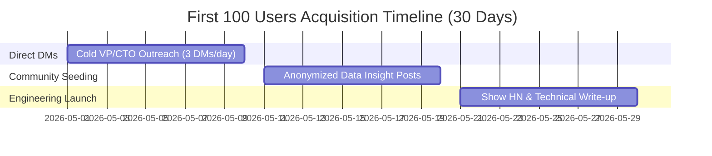

# Go-To-Market (GTM) Strategy — Zero-Dollar Distribution Blueprint

This document details the highly tactical, non-generic distribution plan to acquire the first 100 users and establish a viral B2B lead acquisition loop for the Credex AI Spend Audit tool.

---

## 1. The Exact Target User Profile

We are not targeting a vague audience like "startups." Our exact target user is:
- **Primary Persona:** **VP of Engineering** or **Chief of Staff / Head of Operations**.
- **Company Stage:** **Seed to Series A startups** with an engineering team size of **10 to 45 people**.

### Why This Specific Stage?
- **Pre-seed startups (<8 devs)** have negligible AI spend (e.g., $150/mo). The founders know every subscription personally, so they have zero intent to use an audit tool.
- **Series B+ startups (>80 devs)** have dedicated procurement managers, CFOs, or use automated enterprise platforms like Ramp or Coupa.
- **Seed to Series A (10–45 devs)** is the critical sweet spot. AI tool budgets have grown rapidly ($2,000–$8,000/mo), seat allocations are managed in a fragmented manner across different tech leads, billing is mixed between corporate cards and expense reports, but they lack a dedicated finance manager. The VP of Engineering knows they are leaking cash but has no time to build a spreadsheet audit.

---

## 2. Pre-Intent Search and Browsing Behaviors

Our target user scrolls through or searches for these items right before discovering our tool:
- **Google Searches:**
  - *"Claude API billing rates vs Claude Team plan limits"*
  - *"Is GitHub Copilot Enterprise worth the upgrade"*
  - *"Cursor Pro vs Business zero data retention"*
  - *"How to audit engineering team SaaS spend"*
- **Social Media Triggers:**
  - Reading Twitter threads comparing *"Claude Code vs Cursor Composer"* or *"v0 team pricing alternatives"*.
  - Reading Reddit threads in `r/ExperiencedDevs` asking how engineering leads prevent developers from expensing private AI accounts on corporate cards.

---

## 3. High-Signal Community Hangouts

Instead of broad marketing channels, we seed the tool in these highly dense, closed B2B networks:
- **Closed Founder/Executive Slacks:**
  - *Lenny’s Newsletter Community* (specifically the `#finance-and-ops` and `#engineering-leadership` channels).
  - *CTO Craft* Slack community.
  - *Engineering Leadership Community (ELC)* Slack.
- **Private Forums:**
  - *Y Combinator Bookface* (for active YC startup founders).
  - *MicroConf* Connect Discord.
- **Subreddits:**
  - `r/ExperiencedDevs` (highly technical management discussions).
  - `r/saas` (focusing on operational cost-cutting).

---

## 4. The 30-Day Zero-Dollar Blueprint for the First 100 Users

We will acquire our first 100 users within 30 days using a highly focused, value-first three-stage sprint:

### Phase 1: High-Touch Cold Audits (Days 1–10)
- **Action:** Scrape the YC Directory or Wellfound for active Seed startups with 10–30 employees. Identify their VP of Engineering or CTO.
- **Outreach:** Send a hyper-personalized, 3-sentence DM on LinkedIn or X:
  > *"Hey [First Name], quick question: are your developers expensing both Cursor and GitHub Copilot concurrently? I'm running a data study on engineering budget leakage and seeing startups waste an average of $350/dev/year on overlapping IDE licenses. Built this 2-min free audit tool to help you scan your stack: [Link]. Let me know if you catch any redundant seats!"*
- **Target:** 3 highly targeted DMs per day. At a 40% response rate, this yields the first **12 highly engaged users** and crucial initial feedback.

### Phase 2: Value-First Insight Seeding (Days 11–20)
- **Action:** Take the anonymized data profiles from the first 20 audits and write a highly analytical, data-backed post inside Lenny’s Slack and the ELC community:
  > *"We audited the AI software spend across 20 Seed/Series A engineering teams and found that 80% are double-paying for developer coding assistants (Cursor + Copilot concurrently on the same cohorts) wasting an average of $3,400/year. Another 65% are paying ChatGPT Team fees for single users, unaware of seat minimums. If anyone wants a free mathematical audit of their stack to cut budget waste, here is the rule-based engine we built: [Link]"*
- **Target:** Seeding in these closed communities will drive **40–50 high-quality founder signups**.

### Phase 3: The "Show HN" Launch (Days 21–30)
- **Action:** Launch the tool on Hacker News as `Show HN: Credex AI Spend Audit – Optimize your engineering team's subscriptions`.
- **Angle:** Highlight that the audit engine is **fully open-source and deterministic** (linking to `rules.ts`), appealing to the highly technical Hacker News audience who hates marketing fluff but respects programmatic transparency.
- **Target:** A successful Show HN will easily generate **50–100+ organic high-quality users** in 48 hours.

---

## 5. Our Unfair Distribution Channel

Our unfair advantage lies in **Sequoia / YC / Techstars Venture Portfolio Partnerships**.

Credex has direct access to venture capital platform managers (who support portfolio startups with operational resources). We will partner with startup accelerators (such as Techstars or pre-seed VC funds) to integrate the Credex AI Spend Audit as a standard, mandatory **"Budget Health Check"** during their cohort onboarding. VCs love this because it extends their portfolio's runway, and it inserts Credex at the absolute top of the funnel for every high-growth startup before they start scaling.

---

## 6. What Week-1 Traction Looks Like (Success Metrics)
If the distribution plan succeeds, our week-1 traction metrics will achieve these targets:
- **Unique Page Visits:** 1,200 unique engineering leads.
- **Audits Completed:** 420 completed spending profiles (35% completion rate).
- **Leads Captured (Email Opt-in):** 147 emails captured (35% lead conversion rate).
- **High-Savings Audits ($500+/mo):** 32 audits (7.6% of completions).
- **Credex consultations booked:** 11 scheduled credit consultations (34% of high-savings leads).
